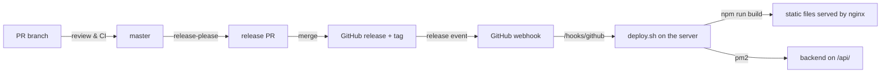

# IT4C.dev

This repository contains the [Website](https://www.it4c.dev) utilizing `vuepress` to generate it and a small backend handling the contact form.

## Software requirements

This package requires:

- [nodejs](https://github.com/nodejs/node) (version pinned in `.tool-versions`)
- [npm](https://github.com/npm/cli)

On alpine you need to install the following software to get the `vuepress-plugin-imagemin` properly installed:

```sh
apk add autoconf libtool automake build-base nasm libpng-dev
```

## Techstack

Frontend (`/`):

- [vuepress](https://github.com/vuepress/core) with the vite bundler
- [vuepress-theme-hope](https://github.com/vuepress-theme-hope/vuepress-theme-hope)
- [tailwindcss](https://github.com/tailwindlabs/tailwindcss)
- [vuepress-plugin-imagemin](https://github.com/vuepress/vuepress-plugin-imagemin)

Backend (`/backend`):

- [fastify](https://github.com/fastify/fastify) with [typebox](https://github.com/sinclairzx81/typebox)
- [nodemailer](https://github.com/nodemailer/nodemailer)
- [tsup](https://github.com/egoist/tsup), [tsx](https://github.com/privatenumber/tsx) and [jest](https://github.com/jestjs/jest)

## Usage

How to use this package

### Build

Build the static files of the website which then can be found under `docs/.vuepress/dist/`.

```sh
npm run build
```

### Dev

Bring up a development environment with hot reloading which can be reached [under](http://localhost:8080/)

```sh
npm run dev
```

### Test

Run the tests to ensure everything is working as expected

```sh
npm test
npm run test:lint:typecheck
```

### Backend

The backend serves `POST /mail` for the contact form (exposed as `/api/mail` via nginx) and sends the message via SMTP.

```sh
cd backend
npm install
npm run dev        # watch mode
npm run build      # build into backend/build
npm start          # run the build
npm test           # unit tests
npm run lint
npm run typecheck
```

Configure it via environment variables (or a `backend/.env` file):

| Variable         | Default                         |
|------------------|---------------------------------|
| `NODE_ENV`       | `development`                   |
| `PORT`           | `3000`                          |
| `MAIL_HOST`      | `localhost`                     |
| `EMAIL_RECEIVER` | `admin@it4c.dev`                |
| `EMAIL_SUBJECT`  | `[IT4C] Received EMail from %s` |

## Deploy

You can use the webhook template `hooks.json.template` and the `deploy.sh` script in `.github/webhooks/` for an automatic deployment from a (github) webhook. The hook reacts to published GitHub releases and deploys the released tag.

For this to work follow these steps (using alpine):

```sh
apk add webhook
cp .github/webhooks/hooks.json.template .github/webhooks/hooks.json
vi .github/webhooks/hooks.json
# adjust content of .github/webhooks/hooks.json
# replace all variables accordingly
# ($PROJECT_ROOT, $DEPLOY_DIR, $WEBHOOK_GITHUB_SECRET)

# copy webhook service file
cp .github/webhooks/webhook.template /etc/init.d/webhook
vi /etc/init.d/webhook
# adjust content of /etc/init.d/webhook
chmod +x /etc/init.d/webhook

service webhook start
rc-update add webhook boot

vi /etc/nginx/http.d/default.conf
# adjust the nginx config
# location /hooks/ {
#     proxy_http_version 1.1;
#     proxy_set_header   Upgrade $http_upgrade;
#     proxy_set_header   Connection 'upgrade';
#     proxy_set_header   X-Forwarded-For $remote_addr;
#     proxy_set_header   X-Real-IP  $remote_addr;
#     proxy_set_header   Host $host;
# 
#     proxy_pass         http://127.0.0.1:9000/hooks/;
#     proxy_redirect     off;
# 
#     #access_log $LOG_PATH/nginx-access.hooks.log hooks_log;
#     #error_log $LOG_PATH/nginx-error.backend.hook.log warn;
# }

# The github payload is quite big sometimes, hence those two lines can prevent an reoccurring error message on nginx
# client_body_buffer_size     10M;
# client_max_body_size        10M;

# for the backend install pm2
npm install pm2 -g

# expose the backend service via nginx
vi /etc/nginx/http.d/default.conf
# location /api/ {
#     proxy_http_version 1.1;
#     proxy_set_header   Upgrade $http_upgrade;
#     proxy_set_header   Connection 'upgrade';
#     proxy_set_header   X-Forwarded-For $remote_addr;
#     proxy_set_header   X-Real-IP  $remote_addr;
#     proxy_set_header   Host $host;
#
#     proxy_pass         http://127.0.0.1:3000/;
#     proxy_redirect     off;
#
#     #access_log $LOG_PATH/nginx-access.api.log hooks_log;
#     #error_log $LOG_PATH/nginx-error.api.log warn;
# }

# proxy the current ocelot.social crowdfunding image, so visitors never
# contact a third party (GDPR) while the image stays up to date
# proxy_cache_path /var/cache/nginx/ext levels=1 keys_zone=ext:1m max_size=50m inactive=7d; # http context, outside the server block
# location = /ext/crowdfunding.png {
#     proxy_pass                    https://ocelot.social/crowdfunding/current.png;
#     proxy_ssl_server_name         on;
#     proxy_pass_request_headers    off; # do not forward visitor headers (cookies, user agent, referer)
#     proxy_set_header              Host ocelot.social;
#     proxy_hide_header             Set-Cookie;
#     proxy_cache                   ext;
#     proxy_cache_valid             200 1h;
#     proxy_cache_use_stale         error timeout updating http_500 http_502 http_503 http_504;
#     proxy_cache_background_update on;
#     proxy_cache_lock              on;
#     expires                       1h;
# }
```

For the github webhook configure the following:

| Field                                                | Value                         |
|------------------------------------------------------|-------------------------------|
| Payload URL                                          | https://it4c.dev/hooks/github |
| Content type                                         | application/json              |
| Secret                                               | A SECRET                      |
| SSL verification                                     | Enable SSL verification       |
| Which events would you like to trigger this webhook? | Let me select individual events → Releases |
| Active                                               | [x]                           |

## How it works



A Pullrequest-Review-Workflow is applied to get changes into `master`; the GitHub workflows lint, typecheck, test and build frontend and backend. Every push to `master` lets [release-please](https://github.com/googleapis/release-please) (`.github/workflows/release.yml`) maintain a release PR, which bumps the version from the conventional commit history and updates `CHANGELOG.md`. Merging that PR creates the tag and publishes a GitHub release.

On a published release GitHub calls the webhook on the server, which runs `.github/webhooks/deploy.sh $DEPLOY_DIR <tag>`: it checks out the tag, builds the website into a new directory `$DEPLOY_DIR-<tag>` and switches the symlink `$DEPLOY_DIR` served by nginx to it, then builds the backend and restarts it via `pm2`. The script aborts on the first error, so a failed build keeps the running backend. Without a tag (`deploy.sh $DEPLOY_DIR`) it deploys the latest `master`, which is useful for a manual deployment on the server.

The release workflow authenticates as the `it4c-release-bot` GitHub App (`vars.RELEASE_APP_ID`, `secrets.RELEASE_APP_PRIVATE_KEY`), so the CI workflows also run on the release PR.

To verify a deployment, the footer of the website shows the version of the frontend (linking to its GitHub release) and `https://it4c.dev/api/version` returns the version of the backend.
