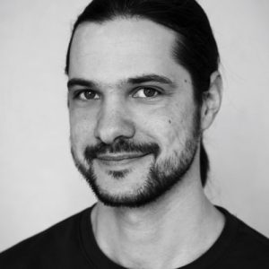

# Mathias 

Verwurzelt im DIY Werken und Interesse an Sprache, Mustern und menschlichen Verbindungen.
Während der Schulzeit unternahm ich erste autodidaktische Schritte in Richtung Computersysteme und Programmierung.
Während seines Studiums der Computerlinguistik verzweigte sich Mathias in verschiedene Bereiche der Computertechnologie.  
Seine Motivation ist es, das Wissen und die praktischen Möglichkeiten zeitgemäßer Werkzeuge zu verbreiten, Skepsis gegenüber ihnen abzubauen und jeden Interessierten zu befähigen, sie für sich zu nutzen.
Und gerade in der Facette der Qualitätssicherung in derSoftwareentwicklung hat er seinen Beruf gefunden.

## Rolle

- Testing (ISTQB zertifiziert)
  - Testkonzeption und -design
  - Testautomatisierung
  - Beratung zu Strategien und Werkzeugen
  - Manuelles Testen
  - Exploratives Testen
- DevOps
- Frontend-Entwicklung

And with a hands-on mentality, he can also contribute to other areas and familiarise himself with new approaches and tools to get an idea or project to work.

## Expertise & Projekte

- Unterstützung des [Gradido Projekts](../projects/gradido.md)
  - Testkonzept
  - Testautomatisierung
  - Agile Testing
  - Frontend-Entwicklung
  - Übersetzung
- Mitwirkung an eHealth-Projekten bei Web-Agenturen
  - Testkonzept und -planung
  - Konzeption
  - Testautomatisierung
  - Manuelles Testen
  - Exploratives Testen
- Übersetzungen für OSS Projekte
- Unterstützung einer quelloffenen 3D-Multiplayer Gaming Engine
  - Portierung: Java nach C++
  - Einrichtung und Pflege von Build-Systemen für Unix-Betriebssysteme
  - Patching

## Ansätze & Werkzeuge

### Testverfahren

- [Test Driven Development](https://de.wikipedia.org/wiki/Testgetriebene_Entwicklung)
- [Behavior Driven Development/Testing](https://www.bddtesting.com/)
- Testen nach Konzept und Plan
- Exploratives Testen (basierend auf Intuition und Erfahrung)

### Testautomatisierung

- [Robot Framework](https://robotframework.org/)
- [Playwright](https://playwright.dev/)
- [Cypress](https://www.cypress.io/)
- [Selenium](https://www.selenium.dev/)
- [Appium](https://appium.io/)
- [RSpec](https://rspec.info/)
- [Insomnia](https://insomnia.rest/)
- [Cucumber](https://cucumber.io/) and [Gherkin](https://cucumber.io/docs/gherkin/)
- [Katalon Studio](https://katalon.com/)

### Testmanagement & -reporting
- [Trac](https://trac.edgewall.org/)
- [TestRail](https://www.gurock.com/testrail/)
- [Xray](https://www.getxray.app/)
- [Github Issues](https://docs.github.com/en/issues)
- [GitLab Test Cases](https://docs.gitlab.com/ee/ci/test_cases/)
- [Jira bug tracking](https://www.atlassian.com/software/jira/features/bug-tracking)

### Computersprachen

- [Javascript](https://www.javascript.com/)
- [Python](https://www.python.org/)
- [Ruby](https://www.ruby-lang.org/)
- [C++](https://de.wikipedia.org/wiki/C%2B%2B
- [HTML](https://de.wikipedia.org/wiki/Hypertext_Markup_Language)
- [CSS](https://de.wikipedia.org/wiki/Cascading_Style_Sheets)
- [LaTex](https://www.latex-project.org/)

## Weitere Engagements und Interessen

Neben der Computertechnik gibt es Engagements und Interessen in

- Leckeres und gesundes Essen und Kochen
- Musik - Rhythmen und Liedtexte
- Menschliche Verbindungen
- Literatur
- Austausch von Zeit
- Die Punkte miteinander verbinden

## Gesprochene Sprachen

- Deutsch (Muttersprache)
- Englisch (verhandlungssicher)

### Profil

[GitHub](https://github.com/mahula)
