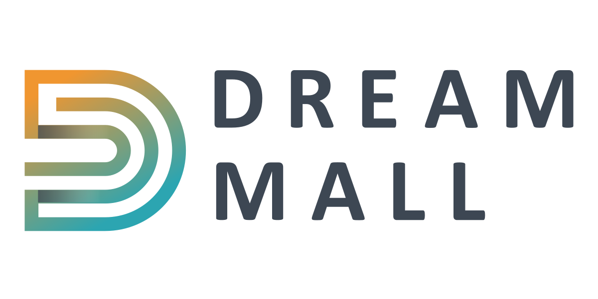

# DreamMall.earth

*DreamMall.earth* ist eine Video & Projekt Management Plattform, die als Open-Source-Software für Claudia Siebert und Sabine Laudien entwickelt wird. Das Projekt schafft einen *beweglichen Raum* für Unternehmer und Selbstständige ihre Ideen in die Realität zu tragen und Unterstützung von Gleichgesinnten zu finden.

Das zentrale Element des Projektes ist eine *Sternenkarte*, welche die einzelnen Akteure und Projekte an einen fiktiven Sternenhimmel projiziert. Der Nutzer kann in Austausch mit Anderen gehen, in dem er seinen Raum öffnet und andere dazu einläd. Ein Raum ist eine Videokonferenz mit Chatfunktion & Bildschirmfreigabe.

In der Zukunft sind Projektmanagementwerkzeuge angedacht, die es dem Nutzer vereinfachen seine Projekte zu organisieren und andere daran teilhaben zu lassen.

Mehr Infos auf [DreamMall.earth](https://dreammall.earth) und [GitHub](https://github.com/dreammall-earth/dreammall.earth).

## Techstack

*DreamMall.earth*  basiert auf der *Node.js*-Technologie. Es kommt *vue*, *vike*, *vuetify*, *apollo*, *graphql* und *prisma* zum Einsatz. Die Video Konferenzen werden mit *BigBlueButton* realisiert.

Für die Konzeptionelle Arbeit an dem Projekt kommt *Figma* zum Einsatz.